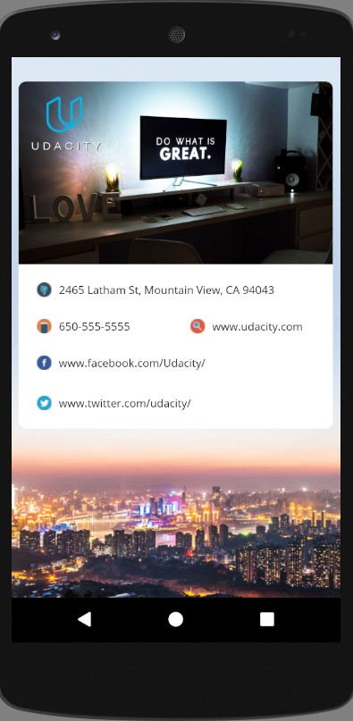

# Hello Android

Single Screen App (Project #1) for Google Developer Challenge Scholarship: Android Basics

<strong>Design Requirements</strong>
<ul>
  <li>Design includes, at minimum, the following text (business name, address, and phone number):
    <ul>
      <li>Udacity</li>
      <li>2465 Latham St</li>
      <li>Mountain View, CA 94043</li>
      <li>650-555-5555</li>
    </ul>  
  </li>
  <li>Design includes at least one image that the student feels represents the business in some way (creativity is fine, and encouraged!)</ul>

<strong>Code Requirements</strong>
<ul>
  <li>At least one ViewGroup is included</li>
  <li>XML must include a RelativeLayout or LinearLayout</li>
  <li>ViewGroups contain at least one ImageView and at least one TextView</li>
  <li>The project must have one or more ImageViews and TextViews</li>
</ul>  

<em>Requirements copied from: <a href="http://udacity.com">udacity.com</a>.</em>

 

 
  

